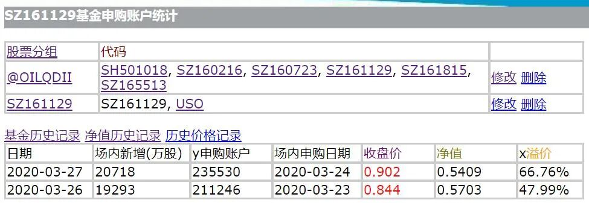

# 华宝油气(162411)交易中各阶级的分析

股票有风险，入市需谨慎。

小白兔，你能别用胡萝卜钓鱼吗？

那都是很好很好的，可是我偏不喜欢。

在[宣传华宝油气(SZ162411)套利的好处](http://mp.weixin.qq.com/s?__biz=MzI0ODYyMzE0Mw==&mid=2247483822&idx=1&sn=135ded3852b723ad825e589865d8ba9c&chksm=e99cb8e6deeb31f07c311c3139657d5872baa161d91096bb372428bddb37a73f921062faebdd&scene=21#wechat_redirect)一文中我说过，按达尔文的观念，一个生态系统中多样性越丰富，其中的物种就越可能延续下去。在[华宝油气(162411)从5月19日开始恢复申购](http://mp.weixin.qq.com/s?__biz=MzI0ODYyMzE0Mw==&mid=2247484411&idx=1&sn=31fdd182b7cc1a754f3e94c406accc17&chksm=e99cbab3deeb33a517b585b47c0ff67839c1cbd29a3138d7333acd6f3250a6cad1b9ed5c02c8&scene=21#wechat_redirect)一文中我再次试图讲述生态系统的故事，但是总感觉词不达意。所以今天我打算放弃高屋建瓴的梦想，反过来从底层开始罗列现象，看能不能至少做到让自己满意。

1. 定投的韭菜

华宝油气每年管理费1%，托管费0.28%，这是实实在在的暴利。基金公司因此最热衷于宣传定投。在基金行业多年洗脑下，很多其实可能并没有直接利益相关的自媒体也都跟着鹦鹉学舌喊定投，打着些全球大类资产配置之类冠冕堂皇的旗号。

一个广泛的定投群体是流动性的根源。就像瞪羚和狮子生活的非洲大草原上的野草，或者用我们熟悉的草本植物名称：韭菜。

野火烧不尽，春风吹又生。没有定投的韭菜，就没有下文中的一切。提前举个例子，我习惯的溢价预测方式是：假如今天华宝油气溢价收盘，晚上XOP的净值又继续上涨的话，那么明天华宝油气会继续溢价。事实上，如果没有众多定投者提供的流动性，这个判断就无法成立。我写[石油基金(160416)和IXC跨市场套利](http://mp.weixin.qq.com/s?__biz=MzI0ODYyMzE0Mw==&mid=2247484024&idx=1&sn=af3eb8d2d26d3a45101f0bdcfeb99175&chksm=e99cbb30deeb3226c398b62c91eb94f90b84c5664664e758ebb2f3f2d8bbfca8685baf4d4448&scene=21#wechat_redirect)时手痒实践了一把，马上就被打脸了。

2. 固定网格交易者

韭菜也是会进化的。进化的第一站就是固定网格交易。有人喜欢吹嘘自己是固定网格交易的原创者，这实在是太过于高估自己的原创能力了。从定投到固定网格交易，其实背后的驱动力完全是飞蛾扑火的本能。随便一个傻子想改进自己的定投方式，都会想到固定网格交易。

固定网格交易者进一步提供了流动性。从华宝油气的盘面看，大多数交易都会集中在0.250、0.255和0.260这种末位逢5逢0的价格上，背后的驱动力就是固定网格交易者。

跟把钱存银行比，[定投和固定网格交易](http://mp.weixin.qq.com/s?__biz=MzI0ODYyMzE0Mw==&mid=2247484344&idx=1&sn=89903bb7ceab9776e9cd1d697867c8b3&chksm=e99cbaf0deeb33e680aca3a502f2f9f63d07f139c872a8afa936fc39f8ade904fe347b63503a&scene=21#wechat_redirect)者难能可贵的走出了[巴菲特](http://mp.weixin.qq.com/s?__biz=MzI0ODYyMzE0Mw==&mid=2247484378&idx=1&sn=b32e53b8a128293ded13b518617d29cf&chksm=e99cba92deeb3384d3462f1004a1b3a70e376ed482f121971c3ea587fab538d494bcb18d5065&scene=21#wechat_redirect)的第一步，这是值得赞扬肯定的。

3. 申购赎回套利群体

定投和固定网格交易者都不太关注净值，或者说即使他们知道净值的存在，也会更倾向于坚守自己的所谓纪律而忽视净值。这样一来场内交易价格就会经常溢价或者折价。

华宝油气正常申购费率是1.5%，现在场内申购1折已经普及，华宝基金官网更是有0.1折的场外申购，因此每当场内溢价超过0.15%时，套利群体就会出动了。随着溢价的提高，参与[申购套利](http://mp.weixin.qq.com/s?__biz=MzI0ODYyMzE0Mw==&mid=2247483757&idx=1&sn=c0a49f05a9abcce50b8616109de9b3c7&chksm=e99cb825deeb313391fc3ff1da1fb5659c7a05bf7ad4bf68e54458866d1ef1408c2b15ca4a55&scene=21#wechat_redirect)的群体会急剧扩大。在3月24日原油基金(161129)溢价66%的当天，有接近24万户参与了限购500块人民币的申购套利。

续存期限超过7天，华宝油气赎回费用会从1.5%降到0.5%，因此当场内交易价格折价0.5%以上时，[赎回套利](http://mp.weixin.qq.com/s?__biz=MzI0ODYyMzE0Mw==&mid=2247484299&idx=1&sn=08db6ae7ea57353796eac4b03998dee9&chksm=e99cbac3deeb33d5a032162d3074036f78c310f7d19b6845e3aeac7ce237bd8ff07b3088ca13&scene=21#wechat_redirect)的也会出动。不过因为赎回一直没有限额，所以不太可能准确估算赎回套利者的规模。

从概率上来说，只要溢价或者折价的幅度大于申购或者赎回的费用，长期做溢价和折价套利就一定是赚钱的。但是长期赚钱不等于说每次赚钱，为避免翻车，某些申购赎回套利者进一步进化了。

4. XOP和华宝油气跨市场套利者

假设某天华宝油气场内溢价1%，套利者申购，然后当晚美股大涨，导致华宝油气净值暴涨5%，这种在套利黑话中就叫**翻车**。要避免翻车也容易，只要在当晚美股收盘时卖出相同金额的XOP就可以了，这样最大损失也只是申购费用而已。

因为[XOP和华宝油气跨市场套利](http://mp.weixin.qq.com/s?__biz=MzI0ODYyMzE0Mw==&mid=2247484018&idx=1&sn=b9ffc0629d4e7f4f628e3ba08af7a835&chksm=e99cbb3adeeb322c90f4be51a7baa2cf0cf889804f303e19001c3923bad5ad4a89352d29e34a&scene=21#wechat_redirect)基本上是无风险的，所以参与者一般都会重仓操作，甚至会额外利用短期借贷加很高的杠杆。杠杆越高，能承受的风险就越小，因此重仓的跨市场套利者也经常会成为靶子。

5. 收割跨市场套利者的交易员

为减小风险，避免把套利搞成赌当天油价涨跌，包括我在内的大多数跨市场交易者都会选择在开盘集合竞价阶段平仓。在[解密控盘华宝油气(SZ:162411)交易的幕后黑手](http://mp.weixin.qq.com/s?__biz=MzI0ODYyMzE0Mw==&mid=2247483855&idx=1&sn=98682a4a974ce3ddc1e44c59e1412153&chksm=e99cb887deeb3191c957c5d9642039f074234cfe3443b99234454182be924e9399a5b2fafcb1&scene=21#wechat_redirect)一文中写过，当天只要我卖出，集合竞价就是全天最低价，而只要我买入，集合竞价就是全天最高价。因为有交易员会专门蹲守在这里收割XOP和华宝油气跨市场套利者。

6. 美油期货CL和华宝油气跨市场套利者

道高一尺魔高一丈，为避免在开盘集合竞价阶段被赤裸裸的收割，有部分套利者会选择先用美油期货CL形式上兑现利润，然后等开盘后再择机对应平仓华宝油气和CL。在[XOP和美油期货CL比价](http://mp.weixin.qq.com/s?__biz=MzI0ODYyMzE0Mw==&mid=2247484402&idx=1&sn=74101ea8ff681a1f4a7b7e29e91fd758&chksm=e99cbabadeeb33ac76869668e2c59e3b08243cd5f6e38229242da6fd31f44e0eb4b3b95ff68c&scene=21#wechat_redirect)稳定的时间段，这种交易模式是广为普及的。此外，如果A股交易时间段油价暴涨暴跌，也可以充分利用这个交易获利。因此在阅读原文中华宝油气估值页面中有3种估值，通常的建议是：

做申购赎回套利的，看官方估值。

做XOP和华宝油气跨市场套利的，看参考估值。

做[美油期货CL](http://mp.weixin.qq.com/s?__biz=MzI0ODYyMzE0Mw==&mid=2247484029&idx=1&sn=1c8d68b681029cb58fe746b159516e18&chksm=e99cbb35deeb3223deb925d134cfa2112476b9b767a5c9e6b9bdd197cf754b33d71224cbb301&scene=21#wechat_redirect)和华宝油气跨市场套利的，看实时估值。

7. 日内交易者

华宝油气属于能够T+0场内交易的[QDII](http://mp.weixin.qq.com/s?__biz=MzI0ODYyMzE0Mw==&mid=2247484145&idx=1&sn=e5d2a227bde55cf4a1d5bfb36b4ac2bd&chksm=e99cbbb9deeb32af6972f1df10012c9710b57d46f2888a63e398d30393dea52a2ab4591061c2&scene=21#wechat_redirect)基金，好的流动性也会吸引很多人来做日内交易。常用L2数据的会经常看到买一和卖一都被人用连续的1万手封住了，急于成交的散户通常就会高价按卖一价格买或者低价按买一价格卖，给日内交易者提供极为可观的利润。

当然这种控盘方式也是有风险的，尤其是在日内油价波动大的时候，做美油期货CL和华宝油气跨市场套利的又会冲过来收割控盘的日内交易者。

镰刀处处在，遍地英雄下夕烟。

利益披露：在文章提到的股票中，本人持有XOP的多头仓位。在未来72小时内有频繁交易的打算。
